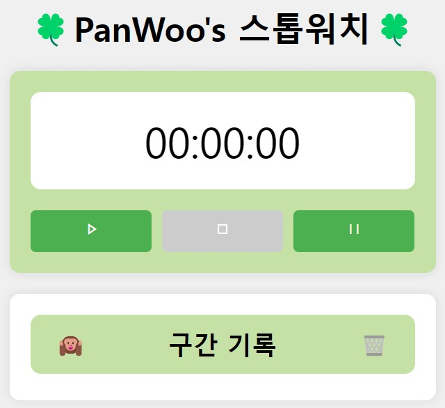

# 🍀피로그래밍 스톱워치🍀
 

### (0) 디자인적 요소 추가
직관적인 UI/UX: 사용자가 쉽게 이해하고 사용할 수 있는 직관적인 인터페이스를 제공  
쌈뽕 디자인: 현대적이고 깔끔한 디자인 요소와 Panwoo 최애 색상을 테마로 하여 시각적인 만족도를 극대화

### (1) 스톱워치 기능
초(second) 및 밀리초(millisecond) 단위로 시간 측정  
시작(start), 정지(그만), 재설정(reset) 버튼 및 기능 구현

### (2) 기록 추가
사용자가 정지 버튼을 누르면 해당 시점의 기록이 자동으로 추가

### (3) 기록 선택 삭제
사용자가 특정 기록을 선택하여 삭제할 수 있음

### (4) 기록 전체 삭제
저장된 모든 기록을 한 번에 삭제할 수 있음

### (5) 전체 선택 버튼
모든 기록을 한 번에 선택할 수 있음 (Feat. 원숭이 아이콘)

### (5.5) 기록 순서 추가
각 기록에 순서를 부여하여 사용자가 쉽게 식별할 수 있음# stop_watch
